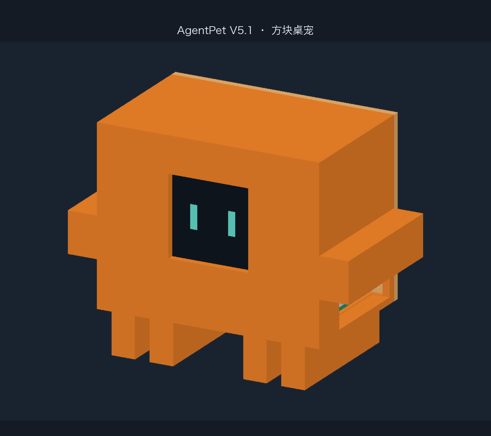
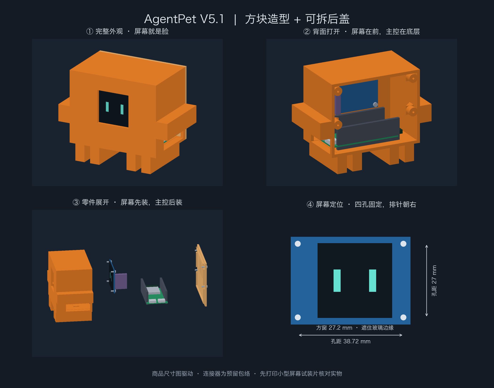
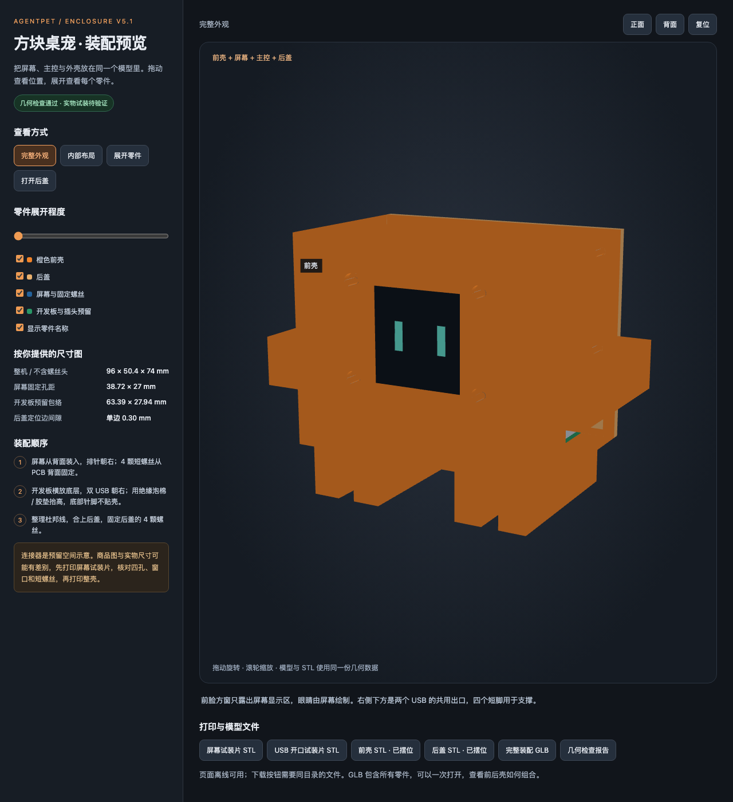
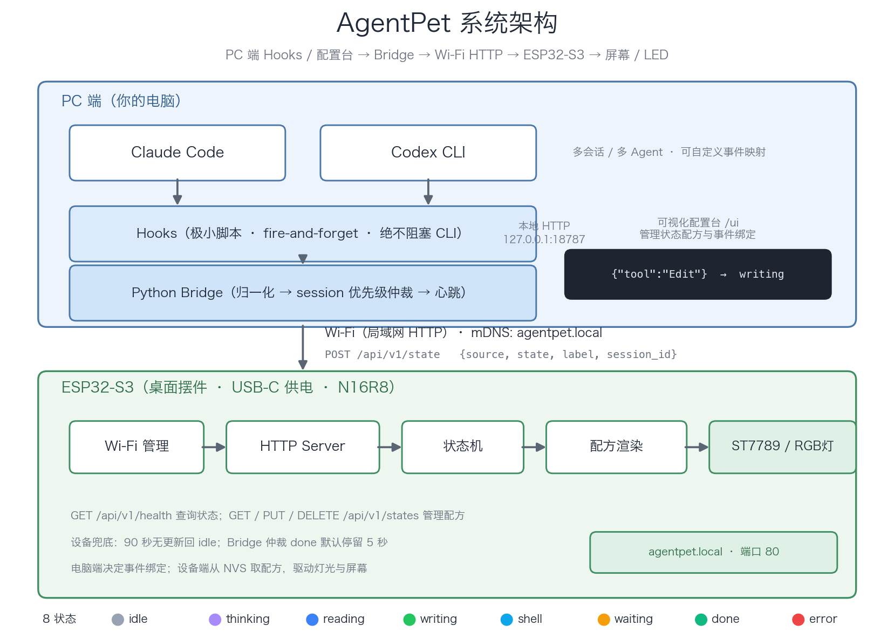

# AgentPet

桌面 AI Agent 状态摆件：电脑端 Claude Code / Codex 的状态经局域网 Wi-Fi 推到
ESP32-S3，通过 1.54" ST7789（240×240）表情屏幕和板载 RGB 灯显示当前状态。

支持状态配方管理、屏幕表情预览、自定义事件绑定和多会话优先级仲裁。
当前外壳为 **V5.1 像素方块版**，已完成软件几何检查，准备进行首轮打印试装。

## 当前外观与装配

下图是按硬件尺寸图生成的 CAD 模型预览。屏幕显示区构成桌宠的脸，开发板放在底层，双 USB 从右侧接线，后盖可拆卸。







- [外壳与装配说明](models/README.md)
- [打印店专用包 V5.1](models/agentpet_print_shop_v5_1.zip)：两块试装片、前后壳、打印说明和装配图。
- [完整模型与源文件包 V5.1](models/agentpet_case_v5_1.zip)
- [完整装配 GLB](models/agentpet_assembly.glb)：一个文件查看全部零件。

下载仓库后，直接用浏览器打开 `models/assembly_preview.html`，可旋转、隐藏外壳、展开零件。
也可在项目根目录运行 `python3 -m http.server 8776 --bind 127.0.0.1 --directory models`，
然后访问 [本地装配预览](http://127.0.0.1:8776/assembly_preview.html)。GitHub 文件页显示 HTML 源码，需要下载或本地运行才能交互。

**软件检查通过不等于实物已验证。** 建议先打印屏幕和 USB 开口试装片，确认孔位、显示区及线头配合，再打印整壳。

## 系统架构

电脑端判断事件对应哪个状态，硬件端根据状态配方驱动屏幕与灯光。
事件映射保存在电脑端 `bridge/mapping.json`；状态配方保存在设备 NVS，断电保留。



## 目录结构

```
agentpet/
├── firmware/            # ESP32-S3 固件（PlatformIO + Arduino，已编译通过）
│   ├── platformio.ini
│   ├── wokwi.toml       # Wokwi 仿真入口
│   ├── diagram.json     # Wokwi 仿真接线
│   └── src/
│       ├── main.cpp     # Wi-Fi + mDNS + HTTP Server + 状态机
│       ├── pet_state.h  # 8 状态定义（与模拟器一一对应）
│       ├── display.cpp  # 矢量表情逐帧渲染（黑底彩五官，整帧推屏防闪烁）
│       ├── config.h     # 引脚 / 超时 / 设备名 / 显示开关
│       └── secrets.h.example  # 复制为 secrets.h 填 Wi-Fi
├── simulator/           # 浏览器表情模拟器（纯静态，直接打开）
├── bridge/              # Python Bridge（事件驱动推送）
│   ├── agentpet_bridge.py   # 规则引擎归一化 + session 仲裁 + 心跳
│   ├── mapping.json         # 事件→状态映射 / 优先级 / 超时（改文件热加载）
│   ├── webui.html           # 可视化配置台（bridge 自动托管）
│   └── test_bridge.py       # 单元测试（python3 test_bridge.py）
├── hooks/               # Claude Code / Codex hooks
│   ├── agentpet_hook.py     # 通用转发脚本（fire-and-forget，离线落盘）
│   └── install_hooks.py     # 一键安装器（自动备份、幂等）
├── tools/
│   └── virtual_device.py    # 虚拟 ESP32：终端表情脸，不插板子跑通全链路
├── models/              # V5.1 外壳、STL/GLB、装配预览、检查报告和打印包
│   ├── build_case.py          # 尺寸与结构的唯一来源
│   ├── render_assembly.py     # 装配图与交互预览生成器
│   ├── final_print_audit.py   # 独立检查导出的 STL / GLB
│   └── README.md             # 尺寸依据、装配与打印说明
└── docs/                # 系统架构图与生成脚本
```

## 快速开始

### 1. 表情模拟器（不需要硬件）

直接用浏览器打开 `simulator/index.html`：
8 个状态按钮切换、3 秒自动轮播、可调 `label` 和 `source`，
下方实时显示对应的 `POST /api/v1/state` 请求体。

### 2. 固件

```bash
pip install platformio
cp firmware/src/secrets.h.example firmware/src/secrets.h   # 填入 Wi-Fi
cd firmware
pio run -t upload            # 烧录（CH343P 串口，可能需要 -u 指定端口）
pio device monitor           # 看日志
```

### 3. Python Bridge（V0.5）

```bash
cd bridge
python3 test_bridge.py            # 16 个单元测试
python3 agentpet_bridge.py --demo # 演示：双会话 + 优先级抢占 + done 过期（约 16s）
python3 agentpet_bridge.py        # 正常运行，推送 http://agentpet.local
python3 agentpet_bridge.py --host 192.168.1.23   # 或手动指定设备 IP
```

手动喂一个事件（模拟 hook）：

```bash
curl -X POST http://127.0.0.1:18787/hook \
     -d '{"hook_event_name":"PreToolUse","tool_name":"Edit","session_id":"test"}'
curl http://127.0.0.1:18787/health
```

仲裁规则：`waiting > error > done > writing > shell > reading > thinking > idle`，
同优先级新的赢；done 停留 5s 后自动让位；90s 无事件的 session 丢弃。
20s 心跳兜底喂固件的 90s 超时。事件到达即时推送（事件驱动，非轮询）。

### 4. Hooks 一键安装（V0.6/V0.7）

```bash
python3 hooks/install_hooks.py             # claude + codex 都装
python3 hooks/install_hooks.py --claude    # 只装 Claude Code
```

- 安装器自动备份原配置（`.bak-时间戳`），只增不删、重复运行幂等
- hook 脚本 0.5s 超时 fire-and-forget，bridge 不在线时事件落盘
  `~/.agentpet/missed-hooks.jsonl`，绝不拖慢 CLI
- 端口冲突时：bridge `--port XXXX`，并设环境变量
  `AGENTPET_BRIDGE=http://127.0.0.1:XXXX/hook`
- 验证：开着 `bridge --dry-run`，正常使用 Claude Code，就能看到真实状态流

### 5. 用 curl 直接驱动固件（V0.4 验收，不经过 bridge）

```bash
curl -X POST http://agentpet.local/api/v1/state \
     -H 'Content-Type: application/json' \
     -d '{"source":"claude","state":"writing","label":"Edit"}'

curl http://agentpet.local/api/v1/health
```

### 6. 虚拟设备：不插板子跑通全链路

```bash
python3 tools/virtual_device.py 8080                                # 终端 A：虚拟 ESP32
AGENTPET_HOST=127.0.0.1:8080 python3 bridge/agentpet_bridge.py      # 终端 B：bridge 指向它
# 正常使用 Claude Code / Codex（或用 curl 喂 hook），终端 A 实时画表情脸
```

### 7. Wokwi 仿真（没有板子也能跑固件）

```bash
# 1) secrets.h 里 SSID 填 Wokwi-GUEST，密码留空
# 2) 编译 + 启动仿真（二选一）：
cd firmware && pio run
wokwi-cli                           # 命令行方式（需先安装 CLI、配置 token）
# 或 VS Code 装 Wokwi 扩展，打开 diagram.json 点播放
```

说明：
- **服务器仿真已部署**：wokwi-cli v0.26.1 装在服务器 `/usr/local/bin`，
  固件与配置在 `/root/agentpet/`。拿到 token 后：
  `WOKWI_CLI_TOKEN=<token> /root/agentpet/run_sim.sh`
- 本地跑也可以：`npm i -g` 不可用（CLI 不在 npm 上），用官方脚本
  `curl -L https://wokwi.com/ci/install.sh | sh`
- Wokwi 没有官方 ST7789 零件，`diagram.json` 用 `wokwi-ili9341` 代演
  （ST77xx 命令集兼容，社区通行做法；仿真屏下方留黑边属正常现象）
- wokwi-cli 自带虚拟 IoT Gateway，仿真里的固件可以访问外网乃至本机 bridge
- 仿真若颜色反色，调 `display.cpp` 里初始化后的反转设置即可

## 状态协议 v1

`POST /api/v1/state`

```json
{"source": "claude", "state": "writing", "label": "Edit", "session_id": "abc123"}
```

| state | 含义 | 表情（黑底 = 屏幕不显示，亮起的只有彩色五官） |
|---|---|---|
| idle | 空闲/睡觉 | 灰蓝：闭眼 ∪ + 飘 z |
| thinking | 思考 | 紫：眼神飘 + 平嘴 + "..." |
| reading | 读取代码 | 蓝：眼睛左右扫 |
| writing | 编辑/写代码 | 绿：眼睛向下 + o 嘴 |
| shell | 执行命令 | 青：嘴 = `> _` 提示符闪烁 |
| waiting | 等待确认/授权 | 琥珀：瞪大眼 + 嘴 = 大问号 |
| done | 任务完成 | 翠绿：笑眼 ∩ + 大笑嘴（5s 后自动回 idle） |
| error | 异常/失败 | 红：X 眼 + 波浪嘴 + 轻微抖动 |

`GET /api/v1/health` 返回：state / state_for_s / source / label / session_id /
uptime_s / wifi / rssi / heap / ip。

兜底规则：90 秒没有任何事件自动回 idle；done 停留 5 秒回 idle。

## 状态配方系统（V1.0）

板子内置"配方库"（NVS 持久化，断电不丢），出厂预置 8 个状态，支持动态增删改：

```bash
# 列出板上全部状态
curl http://agentpet.local/api/v1/states
# 新增自定义状态（灯光 + 屏幕）
curl -X PUT http://agentpet.local/api/v1/states/tea \
     -H 'Content-Type: application/json' \
     -d '{"led":{"color":"#3BC4E8","mode":"breath","period":1500},"screen":{"color":"#3BC4E8","eye":"happy"}}'
# 查看 / 删除
curl http://agentpet.local/api/v1/states/tea
curl -X DELETE http://agentpet.local/api/v1/states/tea
```

灯效 mode：`steady` 常亮 / `breath` 呼吸 / `blink` 闪烁 / `double` 双闪，
period 50~20000ms（steady 忽略）。预置状态可覆盖更新。

**bridge 事件映射**同样数据化（`bridge/mapping.json`）：规则（source/event/tool 通配/字段匹配）
→ 状态、优先级表、超时。改文件保存即热加载，不用重启。

### 可视化配置台（V1.2）

bridge 跑起来后，浏览器打开 **http://localhost:18787/ui**：

- 状态配方：管理一份状态中的灯光与屏幕配置，可新增、编辑、删除和试播。
- 灯光预览：颜色、灯效、周期；屏幕预览：五官、颜色及动画参数。
- 事件绑定：编辑 `mapping.json` 的事件映射与优先级，保存即热加载。
- 配方保存到板子 NVS；界面中的预览与试播用于检查效果，保存用于持久化。
- 板子固件已开 CORS，网页可跨域直连板子；自动从 bridge 获取板子 IP

## 屏幕接线（交接文档第 3 节）

| ST7789 | ESP32-S3 | 备注 |
|---|---|---|
| VCC / GND | 3V3 / GND | |
| SCK | GPIO12 | |
| MOSI | GPIO11 | |
| CS | GPIO10 | |
| DC | GPIO13 | |
| RST | GPIO14 | |
| BLK | 3V3（V0） | 后续可改 GPIO21 PWM 调光 |

避开：GPIO48（板载 RGB）、GPIO0（BOOT）、GPIO19/20（USB）、GPIO43/44（串口）、
GPIO35/36/37（N16R8 Octal PSRAM 占用）。

## 3D 打印外壳（V5.1）

已按屏幕与 ESP32-S3 商品尺寸图重建像素方块外壳，包含屏幕四孔固定、主控胶垫区域、双 USB 共用出口和可拆后盖。
V5.1 将主控向 USB 一侧移近 3.5 mm，USB 共用开口为 **32.34 × 12 mm**，接口后缩约 **2.8 mm**；后盖螺柱加入斜撑。

| 项目 | 当前设计 |
|---|---|
| 整机最大尺寸 | 96 × 50.4 × 74 mm，不含螺丝头 |
| 屏幕固定孔距 | 38.72 × 27 mm |
| 屏幕窗口 | 27.2 × 27.2 mm，遮住玻璃边缘 |
| 后盖定位边间隙 | 单边 0.30 mm |
| 屏幕 / 后盖螺丝 | Ø2 × 5 mm / Ø2 × 6 mm，自攻，各 4 颗 |
| 软件检查 | 54 项模型检查 + 29 项导出文件检查通过 |

打印文件按顺序使用：

1. [屏幕试装片](models/screen_fit_coupon.stl)与 [USB 开口试装片](models/usb_fit_coupon.stl)：先验证实物。
2. [前壳打印文件](models/agentpet_case_front_print.stl)与 [后盖打印文件](models/agentpet_case_back_print.stl)：试装确认后，各打印一件。文件已摆位。

首轮建议橙色 PLA / FDM、0.2 mm 层高、3 道壁、100% 比例。
打印店需要检查切片预览并按需加局部支撑；不能仅凭 STL 闭合就判断免支撑。
详见 [打印店交接说明](models/print_shop_instructions.txt)、[尺寸与装配说明](models/README.md)。
实际打印公差、插头、线材和螺丝配合仍待试装确认。

重新生成和检查模型：

```bash
python3 -m venv /tmp/agentpet-cad
/tmp/agentpet-cad/bin/pip install -r models/requirements.txt
/tmp/agentpet-cad/bin/python models/build_case.py
/tmp/agentpet-cad/bin/python models/render_assembly.py
/tmp/agentpet-cad/bin/python models/final_print_audit.py
```

## 路线图

- [x] V0.1 固件骨架：Wi-Fi + mDNS + HTTP + 状态机（编译通过）
- [x] V0.2 浏览器 240×240 表情模拟器（8 状态黑底彩五官，动画可调）
- [x] V0.3 ST7789 显示驱动与真屏配置（`AGENTPET_HAS_DISPLAY=1`；当前旋转配置为 2）
- [x] V0.4 固件矢量表情：与模拟器同一套参数移植为 Adafruit GFX（编译通过，真机观感待验证）
- [x] V0.5 Python Bridge：归一化 + session 优先级仲裁 + 心跳 + mDNS 解析（16 测试通过，事件驱动即时推送）
- [x] V0.6 Claude Code hooks：7 事件转发 + 一键安装器（沙箱安装 + 端到端验证通过）
- [x] V0.7 Codex hooks：事件归一化 + 安装器（Codex 配置格式随版本演进，不生效时按官方文档微调 `hooks/install_hooks.py`）
- [x] V0.8 外壳 V5.1：模型、装配预览、试装片、前后壳、打印包与软件检查
- [ ] V0.8 外壳实物打印与试装
- [ ] 后续动画打磨、可选电池版
- [x] V1.0 状态配方系统：配方 NVS 持久化 + GET/PUT/DELETE /states API + bridge 规则引擎（mapping.json 热加载）
- [x] V1.1 屏幕表情配方化（固件按配方 `screen` 字段驱动表情）
- [x] V1.2 可视化配置台（配方管理、屏幕 / LED 预览、事件绑定）

## 主要参考

- [clawd-mochi-esp32s3](https://github.com/TangYifu/clawd-mochi-esp32s3)：硬件完全一致
  （ESP32-S3 + 1.54" ST7789 240×240），ST7789 初始化参数与点屏细节第一参考
- [cc-mochi](https://github.com/alvis-HaoH/cc-mochi)：Claude/Codex hooks 一键安装器、
  事件归一化映射表、session 优先级、表情预览工具思路
- [VibeMonitor](https://github.com/austingregoryus/VibeMonitor)：Python Bridge、局域网 HTTP
- [Tiny Engineer](https://github.com/jamro/tiny-engineer)："设备只懂 REST" 的简单 API 设计
- [AgentDeck](https://github.com/puritysb/AgentDeck)：未来多 Agent / 多设备架构参考
- HachimoDock：桌宠 UI 与产品形态参考
